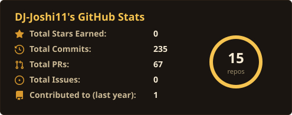
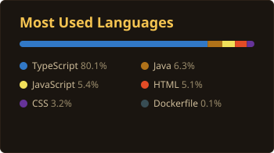
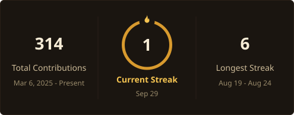
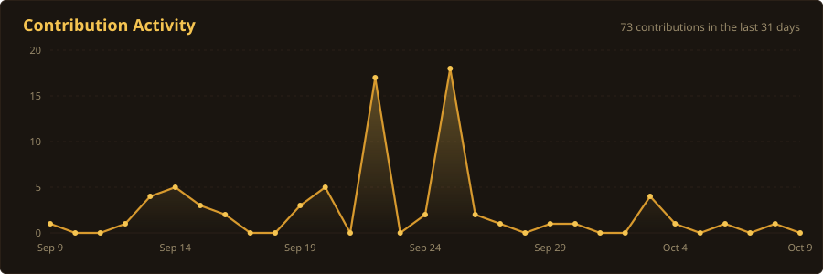

<h3 align="center">Connect with me</h3>

---

<h2 align="center">About</h2>

I'm a Computer Science undergraduate and founder who builds at the intersection of engineering and business. What sets my work apart is a genuinely entrepreneurial instinct — I reason about market dynamics, unit economics, and adoption curves as fluently as I reason about data structures, and I start every product from the customer backward rather than the technology forward.

That lens runs through everything I build. **MarketLab AI** grew directly out of watching founders pour months into ideas the market was never going to validate; **Staqd** came from the real friction of staying current with fast-moving research. I'm far less interested in clever code for its own sake than in software that resolves a genuine, expensive problem for a genuine person.

**Founder & Full-Stack Engineer** &nbsp;·&nbsp; **Market Intelligence & Developer Tooling**
**Customer-Backward Product Thinking** &nbsp;·&nbsp; **Systems-Deep, Never Black-Box**

---

<h2 align="center">Tech</h2>

---

<h2 align="center">Featured Work</h2>

### MarketLab AI &nbsp;—&nbsp; Founder & Engineer

A market-simulation platform that lets founders pressure-test demand before they commit to building. The engine runs a four-method modeling stack — Bass diffusion, agent-based modeling, random-utility logit, and Monte Carlo — to produce ranged P10 / P50 / P90 forecasts, layered with an LLM inference engine calibrated against diffusion-of-innovations theory. Deliberately built as a risk-signal engine for founders, not a revenue-forecasting toy.

### Staqd &nbsp;—&nbsp; Backend Engineer

A research-paper knowledge hub that turns the arXiv firehose into a readable, searchable feed. I own the backend: a daily ingestion pipeline (arXiv → Gemini summarization → database) running on Supabase Edge Functions, plus live document-upload processing and a continuously refreshed knowledge feed.

### LeetTrack &nbsp;—&nbsp; Founder & Engineer

A calendar-driven spaced-repetition tracker for LeetCode practice. Logging a question number is enough — difficulty, topics, and optimal complexity are fetched and AI-enriched automatically, solved questions sync in on their own, and review checkpoints land on fixed calendar dates with auto-generated milestone exams that blend your own history with AI-suggested, API-validated questions on the same topics.

### Halt &nbsp;·&nbsp; CampusCompass

**Halt** — a shipped Android app that helps users break doomscrolling habits, in a retro arcade aesthetic. Built end to end with persistent state and custom animations, running on a real device. &nbsp;`React Native` `Expo`

**CampusCompass** — a college discovery and comparison tool with search, detail, and side-by-side compare, designed and deployed end to end under a tight deadline. &nbsp;`Next.js` `Prisma` `Vercel`

---

<h2 align="center">GitHub Statistics</h2>

  

  

 
Self-generated every 6 hours by a GitHub Action — no third-party stat servers.

---

### Open to Summer 2027 Software Engineering Internships

